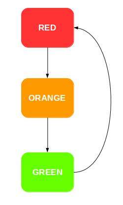
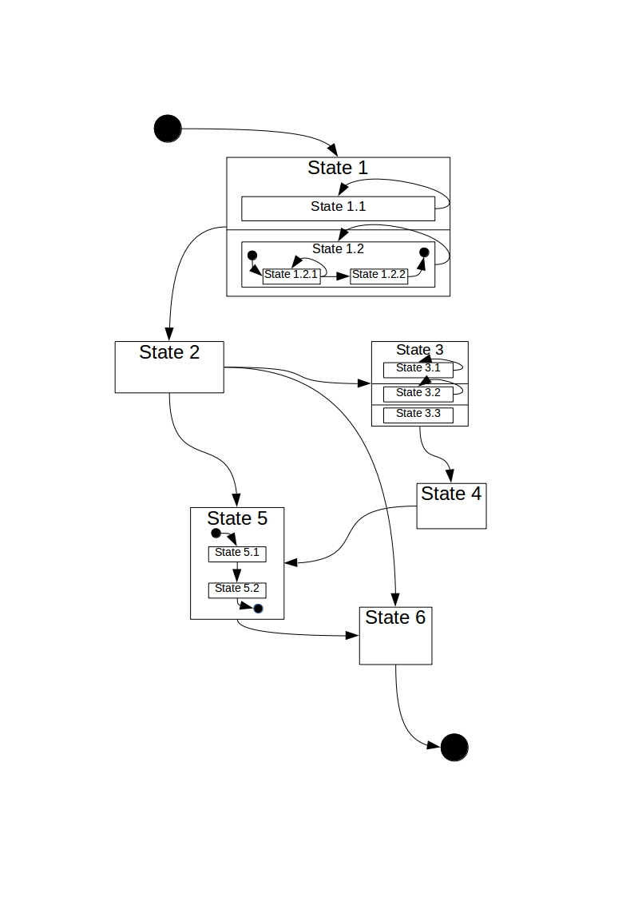

#Generate Componet with State Machine

Usualy, when we create a component, this componet used a State Machine. So we must create a state machine from scratch. With robocomp it is now much easier. 

These are the steps to create a state machine with robocomp:
##### Create the directory of component

We that create the directory in which the new component will be located. For example:

	mkdir mycomponet

##### Definition State Machine

We move to the directory of our component:

	cd mycomponet

Now, we that execute the next line for generate the files in which our component will be defined:

	robocompcdsl mycomponent.cdsl

When you run this line two files are created mycomponent.cdsl and statemachine.smdsl. In stachine.smdsl we have to define our state machine, following the next struct:

	name_machine{
		[states name_state *[, name_state];]
		[initial_state name_state;]
		[end_state name_state;]
		[transition{
			name_state => name_state *[, name_state];
			*[name_state => name_state *[, name_state];]
		};]
	};

	[:parent_state [parallel]{
		states name_state *[, name_state];
		[initial_state name_state;]
		[end_state name_state;]
		[transition{
			name_state => name_state *[, name_state];
			*[name_state => name_state *[, name_state];]
		};]
	};]

For example of mycomponent.cdsl:

	import "/robocomp/interfaces/IDSLs/import1.idsl";
	import "/robocomp/interfaces/IDSLs/import2.idsl";

	Component mycomponet
	{
		Communications
		{
			implements interfaceName;
			requires otherName;
			subscribesTo topicToSubscribeTo;
			publishes topicToPublish;
		};
		language Cpp;
		gui Qt(QWidget);
		statemachine "statemachine.smdsl";
	};

##### Easy example: semaphore

For example:

On this component we will define a state machine that simulate the function of a semaphore. For it, we copy and paste the next definition of the state machine in file statemachine.smdsl:

	Semaphore{
		states green, orange;
		initial_state red;			// It may not be contained in the states list. initial_state is required
		transition{
			red => green;
			green => orange;
			orange => red;
		};
	};

For that robocompcdsl will generate the code of component, we will run the next line:

	robocompcdsl mycomponent.cdsl .

Our component have a funtion for each state the our state machine. Now, we will implement this funtions that be run when a state is active. This funtions are contained in file **specificworker.cpp** or **specificworker.py**. For example specificworker.cpp:

	/*
	 *    Copyright (C) 2016 by YOUR NAME HERE
	 *
	 *    This file is part of RoboComp
	 *
	 *    RoboComp is free software: you can redistribute it and/or modify
	 *    it under the terms of the GNU General Public License as published by
	 *    the Free Software Foundation, either version 3 of the License, or
	 *    (at your option) any later version.
	 *
	 *    RoboComp is distributed in the hope that it will be useful,
	 *    but WITHOUT ANY WARRANTY; without even the implied warranty of
	 *    MERCHANTABILITY or FITNESS FOR A PARTICULAR PURPOSE.  See the
	 *    GNU General Public License for more details.
	 *
	 *    You should have received a copy of the GNU General Public License
	 *    along with RoboComp.  If not, see <http://www.gnu.org/licenses/>.
	 */
	#include "specificworker.h"

	/**
	* \brief Default constructor
	*/
	SpecificWorker::SpecificWorker(MapPrx& mprx) : GenericWorker(mprx)
	{

	}

	/**
	* \brief Default destructor
	*/
	SpecificWorker::~SpecificWorker()
	{
	
	}

	bool SpecificWorker::setParams(RoboCompCommonBehavior::ParameterList params)
	{

		Semaphore.start();					//Start state machine

		timer.start(Period);
	

		return true;
	}

	void SpecificWorker::fun_green()				//State Green
	{
									//your code for this State
	}

	void SpecificWorker::fun_orange()				//State Orange
	{
									//your code for this State
	}

	void SpecificWorker::fun_red()					//State Red
	{
									//your code for this State
	}

To pass from one state to another, we will emit the signals that have been created in file **genericworker.h** or **genericworker.py** For Example genericworker.h:

	/*
	 *    Copyright (C) 2016 by YOUR NAME HERE
	 *
	 *    This file is part of RoboComp
	 *
	 *    RoboComp is free software: you can redistribute it and/or modify
	 *    it under the terms of the GNU General Public License as published by
	 *    the Free Software Foundation, either version 3 of the License, or
	 *    (at your option) any later version.
	 *
	 *    RoboComp is distributed in the hope that it will be useful,
	 *    but WITHOUT ANY WARRANTY; without even the implied warranty of
	 *    MERCHANTABILITY or FITNESS FOR A PARTICULAR PURPOSE.  See the
	 *    GNU General Public License for more details.
	 *
	 *    You should have received a copy of the GNU General Public License
	 *    along with RoboComp.  If not, see <http://www.gnu.org/licenses/>.
	 */
	#ifndef GENERICWORKER_H
	#define GENERICWORKER_H

	#include "config.h"
	#include <QtGui>
	#include <stdint.h>
	#include <qlog/qlog.h>

	#include <ui_mainUI.h>
	#include <qt4/QtCore/qstatemachine.h>
	#include <qt4/QtCore/qstate.h>
	#include <CommonBehavior.h>

	#include <JointMotor.h>

	#define CHECK_PERIOD 5000
	#define BASIC_PERIOD 100

	typedef map <string,::IceProxy::Ice::Object*> MapPrx;

	using namespace std;

	using namespace RoboCompJointMotor;

	class GenericWorker : 
	#ifdef USE_QTGUI
	public QWidget, public Ui_guiDlg
	#else
	public QObject
	#endif
	{
	Q_OBJECT
	public:
		GenericWorker(MapPrx& mprx);
		virtual ~GenericWorker();
		virtual void killYourSelf();
		virtual void setPeriod(int p);
	
		virtual bool setParams(RoboCompCommonBehavior::ParameterList params) = 0;
		QMutex *mutex;
	

		JointMotorPrx jointmotor_proxy;

	protected:
	//State Machine
		QStateMachine Semaphore;

		QState *green = new QState();
		QState *orange = new QState();
		QState *red = new QState();

	//-------------------------

		QTimer timer;
		int Period;

	private:

	public slots:
	//Slots funtion State Machine
		virtual void fun_green() = 0;
		virtual void fun_orange() = 0;
		virtual void fun_red() = 0;

	//-------------------------
	signals:
		void kill();
	//Signals for State Machine
		void redtogreen();						//Signal for transition
		void greentoorange();						//Signal for transition
		void orangetored();						//Signal for transition

	//-------------------------
	};

	#endif

###In C++

For example:

	emit State1toState2;

###In Python

For example:

	self.State1toState2.emit

For run our component we will modificate the file **etc/config** and run with the following line:

	bin/semaphore etc/config

##### Example difficult
For example:

This is the code of the state machine:

	Machine_Statecpp{
		states State2, State3, State4, State5;
		initial_state State1;			// It may not be contained in the states list. initial_state is required
		end_state State6;				// It may not be contained in the states list. initial_state and end_state can't be equal
		transition{
			State1 => State1, State2;
			State2 => State3, State5, State6;
			State3 => State3, State4;
			State4 => State5;
			State5 => State6;
		};
	};

	:State1 parallel{				// If it is parallel, it can't have initial_state and end state
		states State11, State12;
		transition{
			State11 => State11;
			State12 => State12;
		};
	};

	:State12{
		initial_state State121;			// If it isn't parallel, initial_state is required
		end_state State122;
		transition{
			State121 => State121,State122;
		};
	};

	:State3 parallel{
		states State31, State32, State33;
		transition{
			State31 => State31;
			State32 => State32;
		};
	};

	:State5{
		states State52;
		initial_state State51;
		transition{
			State51 => State12;
			State12 => State51;
		};
	};

Robocomp need the following line to implement the state machine. Online This will be contained in mycomponet.cdsl:

	statemachine "statemachine.smdsl";

For example:

	import "/robocomp/interfaces/IDSLs/import1.idsl";
	import "/robocomp/interfaces/IDSLs/import2.idsl";

	Component mycomponet
	{
		Communications
		{
			implements interfaceName;
			requires otherName;
			subscribesTo topicToSubscribeTo;
			publishes topicToPublish;
		};
		language Cpp;
		gui Qt(QWidget);
		statemachine "statemachine.smdsl";
	};

After executing the following line:

	robocompdsl mycomponet.cdsl .

The code is generated. Each state has a method, this method is modified which it is  executed when it enters this state.

To move from one state to another, we will emit the signal with the following structure "statesrctostatedst".

###In C++

For example:

	emit State1toState2;

###In Python

For example:

	self.State1toState2.emit

