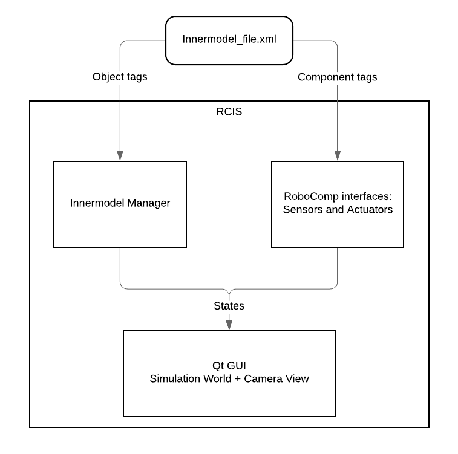

# RoboComp Innermodel Simulator (RCIS)


## Introduction
`RCIS` is one of the core components of RoboComp, which creates a simulation environment for operational testing of individual components or system testing of a combined aggregated system of components. To be concrete, `RCIS` visualizes the [RoboComp's internal representation of the world and the robot itself](innermodel.md).

`RCIS` is implemented in C++ using **QGLWidget** library to draw various sprites such as planes, walls, boxes, robots, etc that represent the simulation world. The picture below describes a general view of implementation parts of `RCIS`:

    

RCIS consists of two main implementation parts: **Innermodel Manager** and **RoboComp interfaces: Sensors and Actuators**. The **Innermodel Manager** part deals with internal physics and transformation between simulated objects. Currently, these are the list of implemented RoboComp interfaces that are ready for simulation:
- Camera
- DifferentialRobot
- IMU
- JointMotor
- Laser
- RGBD
- Display

When starting simulation, `RCIS` will read an XML file for simulation world definitions, then it populates the objects defined in the XML file and start component servers for each of these interfaces. These component servers dedicatedly process information captured from or interacted with the simulation environment.

## Installation

This section assumes the user has already installed the RoboComp core library as in this [guide](../README.md), then we can fetch some meshes and textures used by the simulator (it will take a while):
```
cd ~/robocomp
git annex get .
```  

## Usages

In this section, we will demonstrate an example usage of `RCIS`.
### Run the RCIS
Now let's run the simulator with "simple world" definitions `simpleworld.xml`
```
cd ~/robocomp/files/innermodel
rcis simpleworld.xml
```

Now, RCIS should be up and running with a simple robot endowed with a laser and an RGBD camera, moving on a wooden floor. Please interact with the GUI window by dragging the mouse to see the world with different views.

### Using the keyboard as a JoyStick

To control the robot in the simulation world, we must first install the basic RoboComp components:

```
cd ~/robocomp/components
git clone https://github.com/robocomp/robocomp-robolab.git
```

We want to use our keyboard to control the robot, we can compile the component and call it:

```
cd ~/robocomp/components/robocomp-robolab/components/keyboardrobotcontroller
cmake .
make
src/keyboardrobotcontroller.py etc/config
```
Please use the arrow keys to navigate the robot, the space bar to stop it an 'q' to exit.

Note that you must have your simulator running in a terminal and only then you can run a component in another terminal. You will get an error message if you run the above component without having `RCIS` already running. Also, remember that each RoboComp basic component has its README file, you should check the README file if the component supports the simulation or not.
